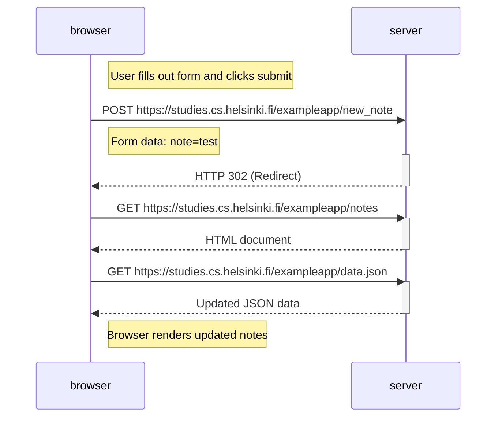

```mermaid
sequenceDiagram
    participant browser
    participant server

    Note right of browser: User fills out form and clicks submit
    browser->>server: POST https://studies.cs.helsinki.fi/exampleapp/new_note
    Note right of browser: Form data: note=test
    activate server
    server-->>browser: HTTP 302 (Redirect)
    deactivate server

    browser->>server: GET https://studies.cs.helsinki.fi/exampleapp/notes
    activate server
    server-->>browser: HTML document
    deactivate server

    browser->>server: GET https://studies.cs.helsinki.fi/exampleapp/data.json
    activate server
    server-->>browser: Updated JSON data
    deactivate server

    Note right of browser: Browser renders updated notes
```