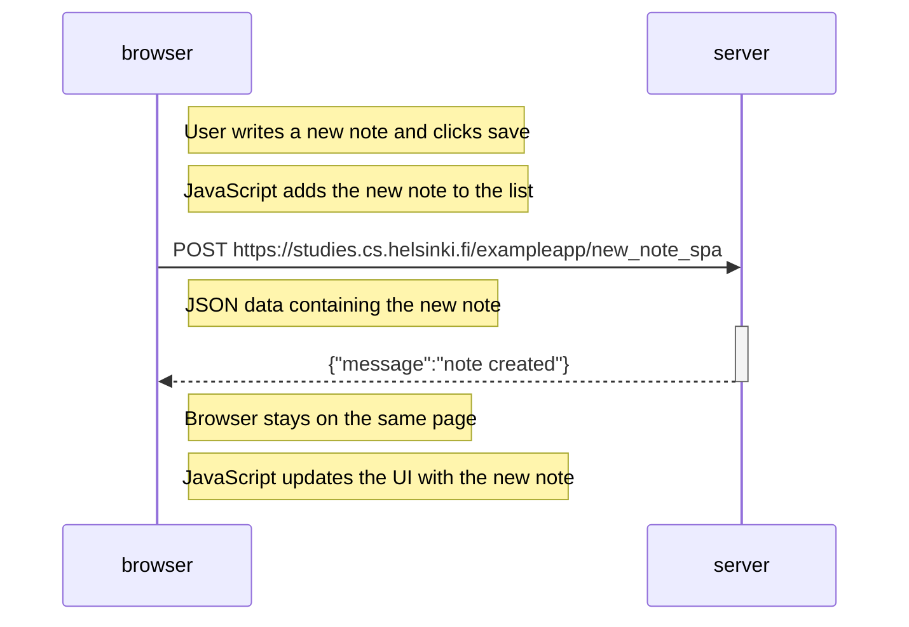

```mermaid
sequenceDiagram
    participant browser
    participant server

    Note right of browser: User writes a new note and clicks save
    Note right of browser: JavaScript adds the new note to the list

    browser->>server: POST https://studies.cs.helsinki.fi/exampleapp/new_note_spa
    Note right of browser: JSON data containing the new note
    activate server
    server-->>browser: {"message":"note created"}
    deactivate server

    Note right of browser: Browser stays on the same page
    Note right of browser: JavaScript updates the UI with the new note
```